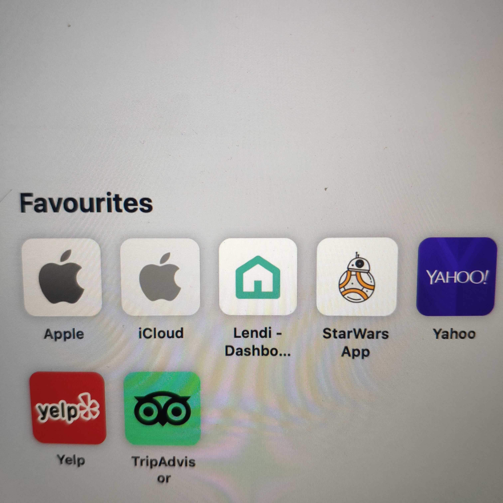
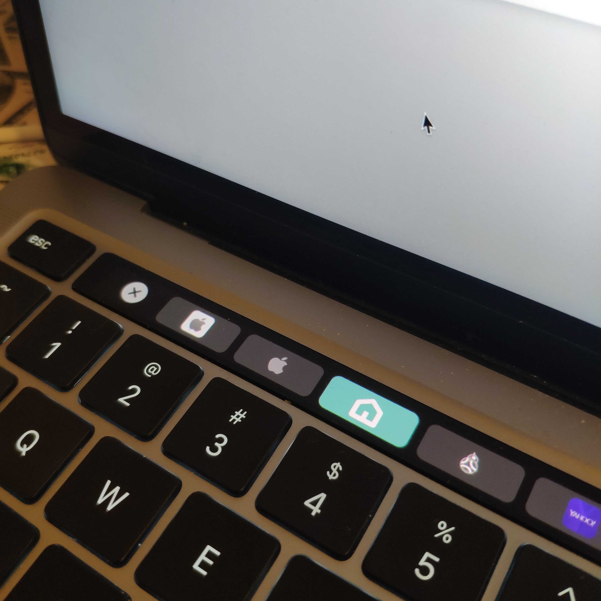
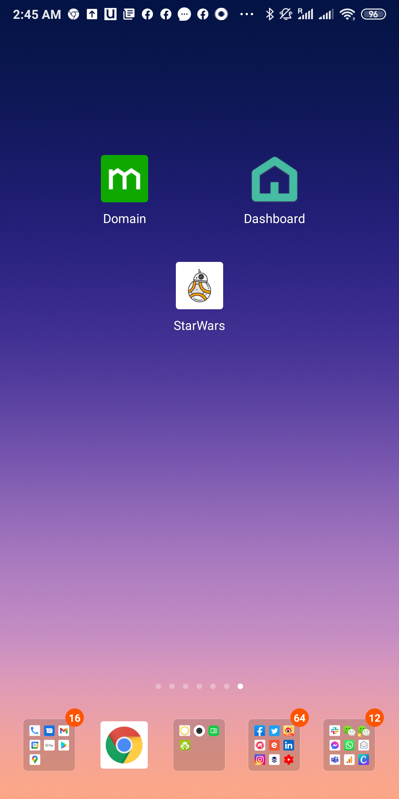

# Star Wars App

    

React Application which requests Start Wars Characters, an technical interview for Sympli.

[Live Site](https://sympli-rjs.netlify.app) | [UI Library](https://sympli-rjs.netlify.app/storybook) | [UI Docs](https://sympli-rjs.netlify.app/docs) | [Bundle Explorer](https://sympli-rjs.netlify.app/explorer) | [Tech Stacks](./DOCS.md)

This project was created with [Create React App](./docs/CRA.md), with PWA.

## Front End Architecture

.

## Screenshots

