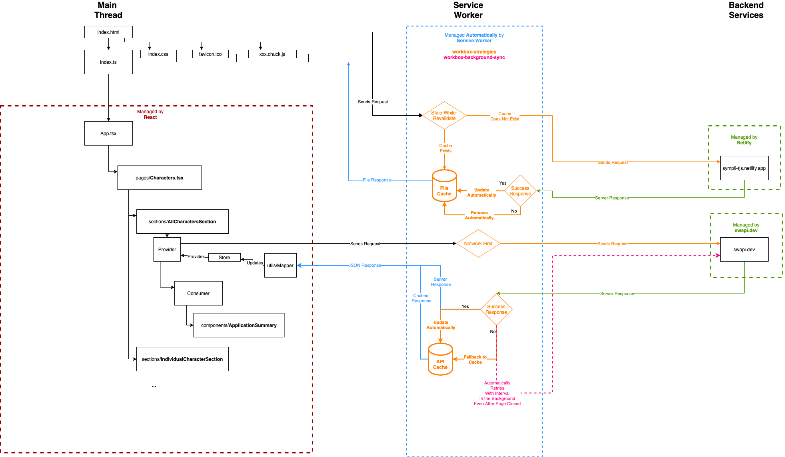
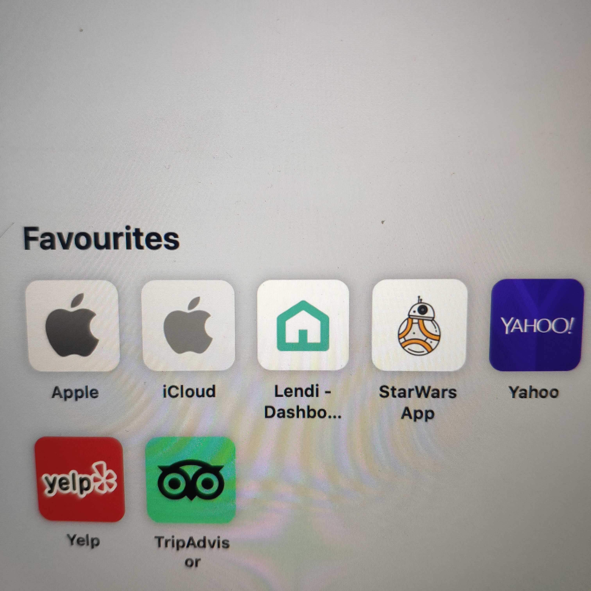
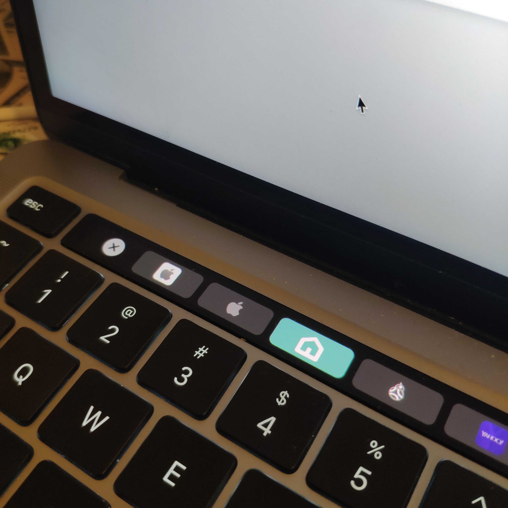
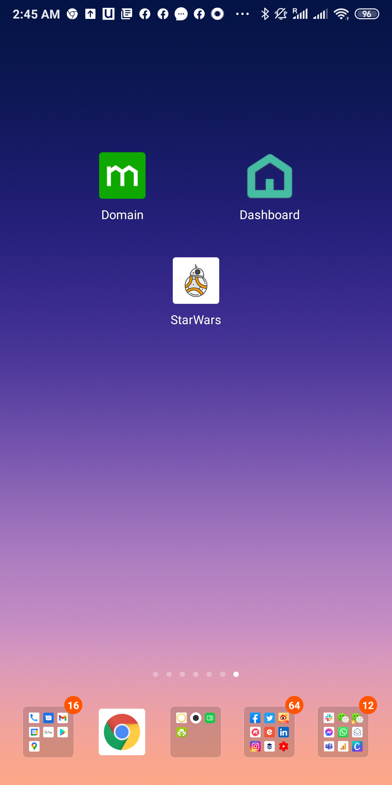

# Star Wars App

React Application which requests Start Wars Characters, an technical interview for Sympli.

[Live Site](https://sympli-rjs.netlify.app) | [UI Library](https://sympli-rjs.netlify.app/storybook/index.html) | [UI Docs](https://sympli-rjs.netlify.app/docs/index.html) | [Bundle Explorer](https://sympli-rjs.netlify.app/explorer.html) | [Tech Stacks](docs/STACK.md)

This project was created with [Create React App](./docs/CRA.md).

It is also an installable, Offline-First PWA, allowing users to use it even when offline.

## Application Architecture

.

## Screenshots

